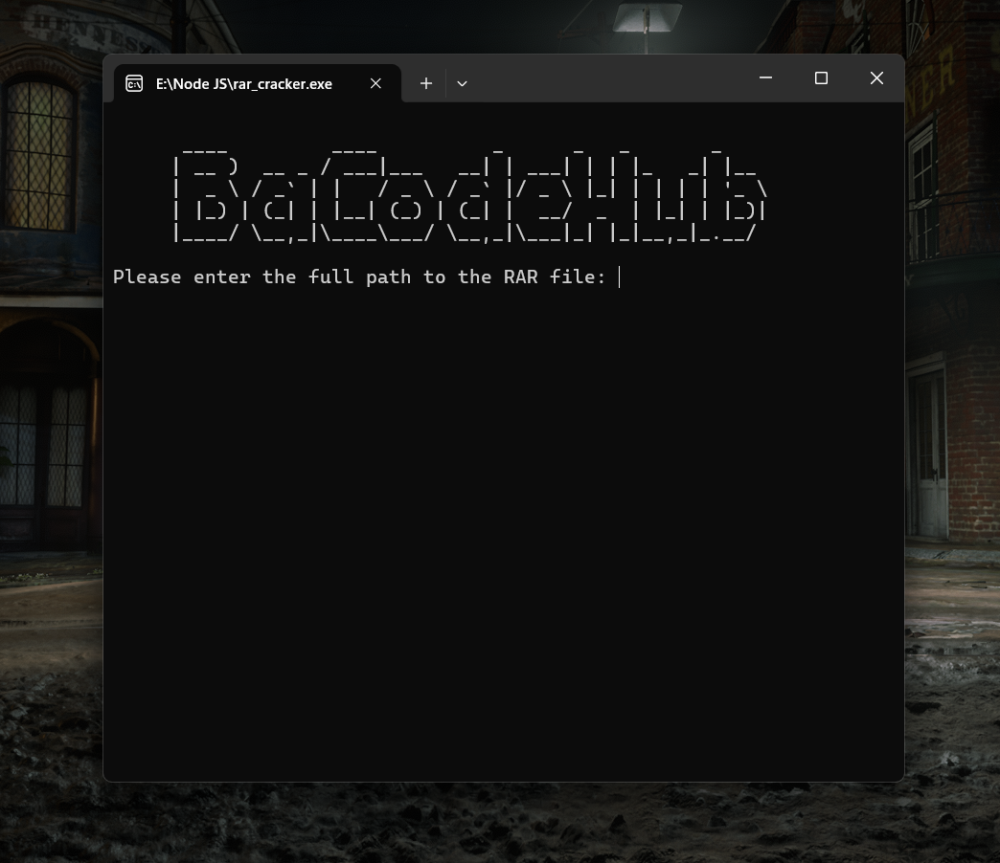

# RAR Cracker Application

This application is a powerful tool designed to unlock RAR archives by attempting to crack their passwords. It uses a combination of real-world leaked passwords and customizable brute-force methods to maximize efficiency and success rates.

  

## Features

- **Comprehensive Password Database:**  
  The application starts by testing over **14 million leaked passwords** from real-world data to quickly crack common passwords.

- **Customizable Brute-Force Mode:**  
  If the password is not found in the database, the application switches to brute-force cracking using user-defined character sets and password length.

- **Password Length Support:**  
  Users can specify a **minimum (1)** and **maximum (127)** password length, allowing for flexible and precise cracking attempts.

- **Automated Extraction:**  
  Once the password is successfully cracked, the application automatically extracts the files and saves them in a directory named **Extracted_Files**.

- **High Efficiency:**  
  Optimized algorithms ensure faster cracking attempts without compromising system performance.

## Download

You can download the application from [Drive](https://drive.google.com/uc?export=download&id=1ZOIbsncSCLCinoQsTWga2zZaNYs2qutp).

## NOTE

This tool is intended for **educational and recovery purposes only**. Unauthorized use to access protected data is prohibited and may violate applicable laws.
